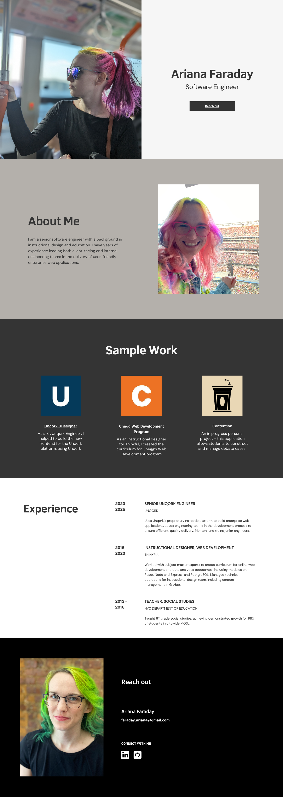

## Initial Prompt

Please help me create a static personal portfolio website using just HTML and CSS. It should match the attached wireframe image.

The website should include information from my LinkedIn profile, which you can view here: https://www.linkedin.com/in/ariana-faraday-b87037115/

The website should have 5 sections:

1. Landing Page: The left side should be a photo and the right side should include my name (Ariana Faraday), my job title (Software Engineer), and a button to email me (faraday.ariana@gmail.com). The background color should be #f6f6f6 and the text color should be #343434.

2. About Me: On the left side, a paragraph summary of my experience. On the right side, another photo. The background color should be #b4b0ab and the text color should be #343434.

3. Sample Work: Three cards, each of which includes a logo, a project title, and a short description of the project. The background color should be #343434 and the text color should be #f6f6f6.

4. Experience: A resume-style chronological list of my work experience. This should be pulled from my LinkedIn profile. The background color should be #ffffff and the text color should be #343434.

5. Reach Out: On the left side, another photo. On the right side, my name, email address, and inline SVG icons that link to my LinkedIn and GitHub profiles. The background color should be #000000 and the text color should be #ffffff.

### Wireframe

## The Good

## The Bad & The Ugly

Adjustments needed:
1. Reference to "Unpack" should be updated to "Unqork".
2. All image placeholder div elements should be updated to actual img elements.
3. "Contrarians" should be updated to "Contention".
4. Remove rounded corners.
5. In the "Landing Page" section, center the text and button elements on the right side.
6. In the "Sample Work" section, convert the project titles to links.

Some text is contained in divs rather than semantic elements.